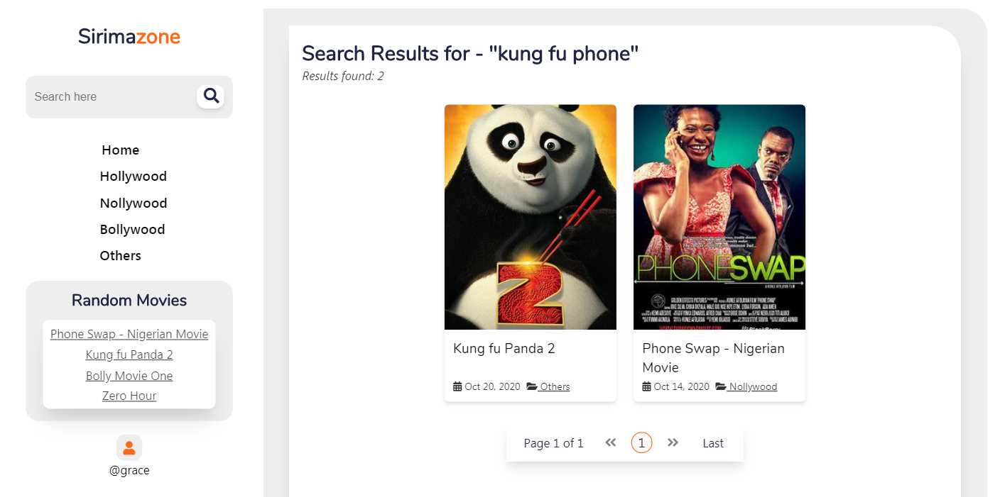

# Sirimazone

#### _...online movie store_

Sirimazone is a full-stack online movie web application for managing video contents. Sirimazone is built with SCSS, JavaScript, jQuery, AJAX, Parcel, PHP, PDO and MySQL.
This project comprises features such as:
- Admin registration system.
- Admin login system.
- File upload system with progress measure(apt for both large and small files).
- Clean Redirection.
- Search system.
- File deletion, file auto-rename on upload.
- Post creation, edit, deletion.
- Post publish/unpublish, pin/unpin.
- Comment system under posts.




## Contributing

If you happen to find any bug or you have a feature request, do well to [create an issue](https://github.com/IGIfeanyichukwu/sirimazone/issues) on it.

Clone the repository 

```bash
    git clone https://github.com/IGIfeanyichukwu/sirimazone.git
```


* Install dependency

 Install `xampp` or `wamp` or any other local webservers with apache and mysql support.

 Sirimazone uses parcel and sass as a development dependency. You need to have parcel and sass installed to build the ES5 JavaScript and CSS files.
 
 Installing parcel and sass globally

```bash
    npm install -g parcel-bundler && npm install -g sass
```

* Install Database
 * Create a database `sirimazone_sql_dbase`.
 * Import the `sirimazone_sql_dbase.sql` file from the `sqldb` directory


* Start server / dev scripts
 The below starts the php server on port 4040, the sass and parcel dev scripts
 
```bash
    npm run dev-scripts
```

 The below starts the sass and parcel dev scripts
```bash
    npm run dev-scripts-no-php-server
```
Create an `uploadz` directory for uploaded files

[Pull requests](https://github.com/IGIfeanyichukwu/sirimazone/pulls) are highly welcome.

## License

Sirimazone is open source licensed under the MIT license.

### Author
[I. G Ifeanyichuwku (Ifex)](https://ig-ifex.netlify.app)